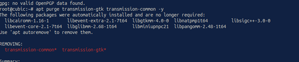
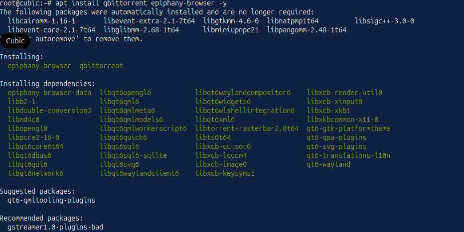
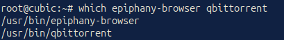
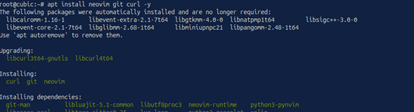
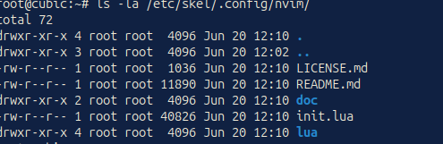
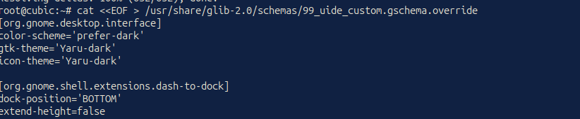
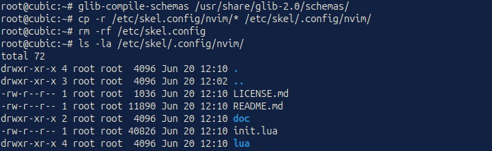

System Base
Base Operating System: Ubuntu 26.04 LTS (Resolute)
Building Tool: Cubic (Custom Ubuntu ISO Creator)
Compression Format: `.xz` (Optimized to drastically reduce the final image size)

Applied Modifications and Technical Justifications

1. Replacement of Free Software (Download Management and Browsing)
Modification: The default BitTorrent client (`transmission-gtk`, `transmission-common`) was removed and replaced with `qbittorrent`. Additionally, `epiphany-browser` was installed as the system's web browser.

*Technical Justification: `qBittorrent` offers an integrated search engine and improved P2P connection management, ideal for academic environments where downloading large ISO images is required. Meanwhile, `Epiphany` (GNOME Web) ensures smooth and integrated browsing with the desktop environment without the high RAM consumption of heavier browsers.

2. Persistent Development Environment (Neovim in Skeleton)
*Modification:** Installing `neovim` and deploying the advanced configuration `kickstart.nvim` directly in the system's skeleton directory (`/etc/skel/.config/nvim/`).

*Technical Justification: This provides the operating system with a highly efficient, ready-to-use, terminal-based Integrated Development Environment (IDE) (preparing the groundwork for future builds). By placing this configuration in `/etc/skel`, absolute persistence is guaranteed; any new user created on the system will automatically inherit these tools in their `/home` directory from their first login.

3. User Interface and Ergonomics (Modification of `gschema`)
*Modification: Overwriting the structural variables of the GNOME environment using the file `/usr/share/glib-2.0/schemas/99_uide_custom.gschema.override` and subsequently compiling the system schemas.

*Technical Justification: The system boots with the dark theme (`color-scheme='prefer-dark'`), the `Yaru-dark` theme, and the dock positioned at the bottom of the screen. This is not a simple temporary user-level adjustment, but rather an injection of static configuration into the OS's graphical core. The goal is to mitigate eye strain for developers from the moment of booting in Live CD sessions or clean installations.

Checksum
MD5 hash de C:\Users\Iván\Downloads\ubuntu-26.04.0-Cubic-UIDE-desktop-amd64.iso:
326aab2e7d99cb4d8fc89132f80ce699
CertUtil: -hashfile comando completado correctamente.
