# PART 2 - BUILD A 64-BIT KERNEL

# Episode 1

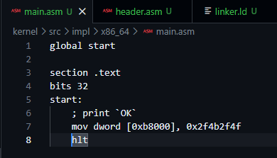
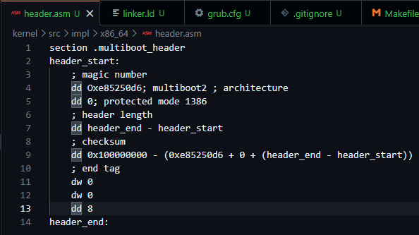
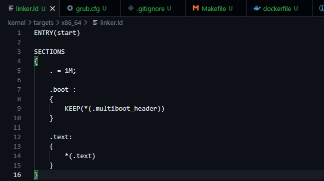
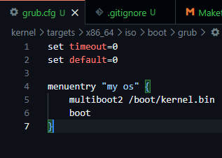
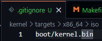
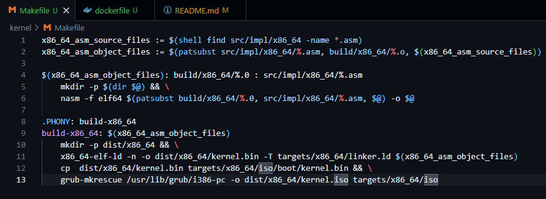
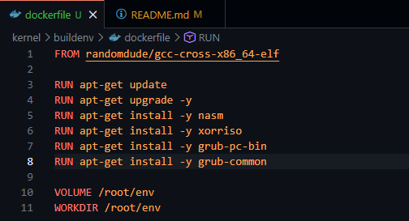

# Episode 2
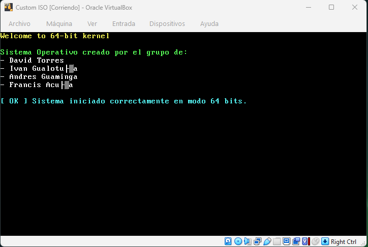
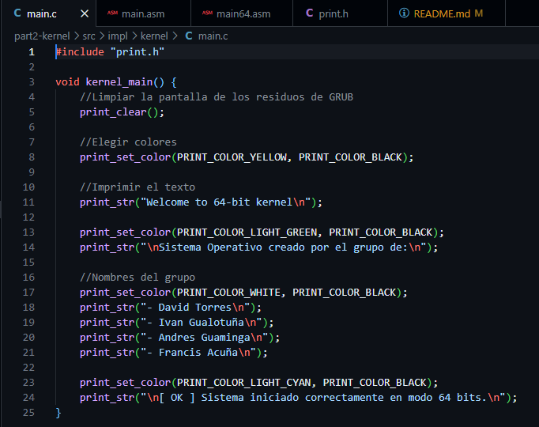
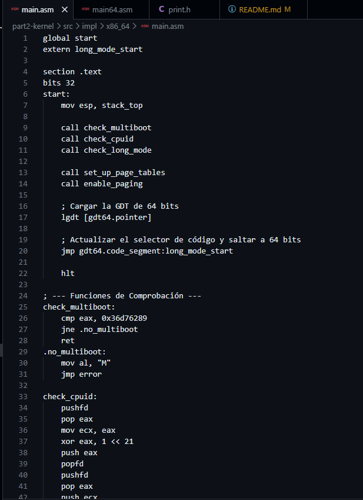
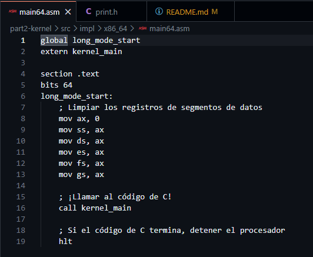
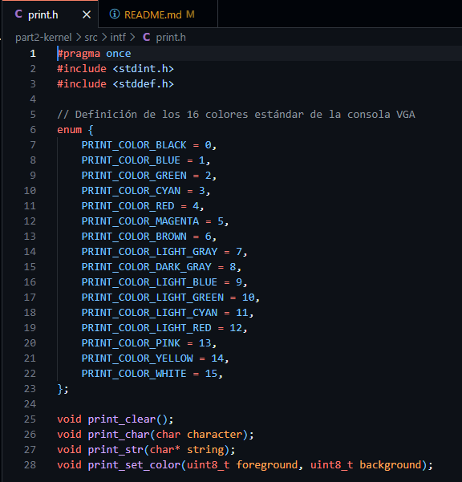


## 1. Build Environment & Toolchain Architecture

To ensure a reproducible compilation independent of the host OS, the kernel was built using an isolated Docker container equipped with a specialized cross-compiler toolchain.

| Component | Technology / Tool | Technical Role / Purpose |
| --- | --- | --- |
| **Build Environment** | Docker (`myos-buildenv`) | Containerized sandbox holding the GCC cross-compiler, NASM, and XORRISO. |
| **Boot Specification**| Multiboot2 | Standardized header (`header.asm`) allowing GRUB to recognize the OS. |
| **Assembler** | NASM | Low-level hardware initialization, CPUID checks, and GDT configuration. |
| **Compiler (C)** | `x86_64-elf-gcc` | Compiling the VGA driver and main kernel logic (`-ffreestanding`). |
| **Linker** | `x86_64-elf-ld` | Merging `.o` files into a single `kernel.bin` based on `linker.ld` memory layout. |
| **ISO Generator** | `grub-mkrescue` | Repackaging the kernel binary into a bootable ISO image. |
| **Emulation** | VirtualBox / QEMU | Hardware virtualization testing targeting `x86_64` architecture. |

---

## 2. Kernel Boot Flow & Memory Topology Diagram

The transition from the bootloader to the 64-bit Long Mode requires configuring identity-mapped Huge Pages (2MB) and defining a 64-bit Global Descriptor Table (GDT).

### DIAGRAM: Execution Pipeline (32-bit Protected Mode to 64-bit Long Mode)
```text
  [ BIOS / UEFI ] ─── Hardware Initialization
         │
         ▼
  [ GRUB Bootloader ] ─── Reads Multiboot2 Header (`header.asm`)
         │
         ▼
  [ 32-bit Entry (`main.asm`) ] 
         ├── 1. Stack Memory Allocation
         ├── 2. CPUID & Multiboot Validation
         ├── 3. Page Tables Setup (Identity map first 1GB via L2/L3/L4)
         └── 4. Load 64-bit GDT (`lgdt [gdt64.pointer]`)
         │
         ▼
  [ 64-bit Jump (`main64.asm`) ] ─── `jmp gdt64.code_segment:long_mode_start`
         ├── 1. Modify old main.asm to more complex code for 64 bit
         └── 2. Clear old data segment registers
         └── 3. Call C Kernel (`call kernel_main`)
         │
         ▼
  [ C Kernel Main (`main.c`) ] ─── Hardware interaction logic
         └── 1. Access VGA Text Buffer directly at Memory `0xb8000`
         └── 2. Clear screen and print custom OS string.

