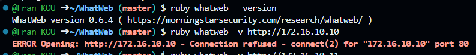
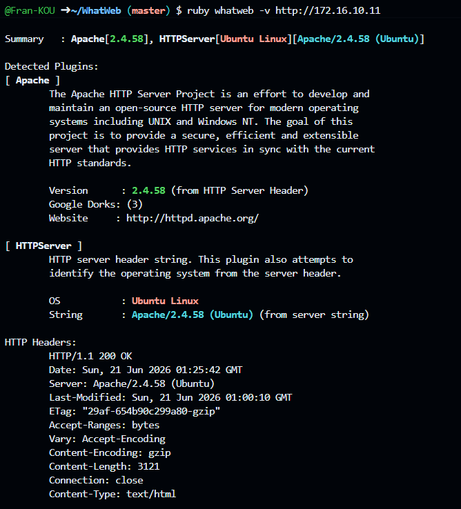
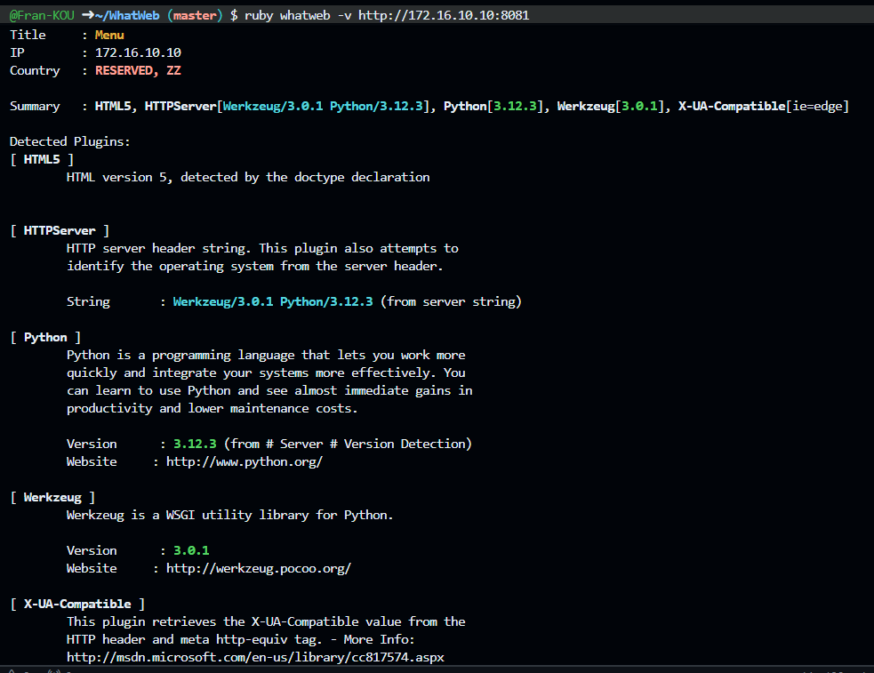
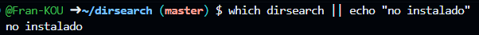
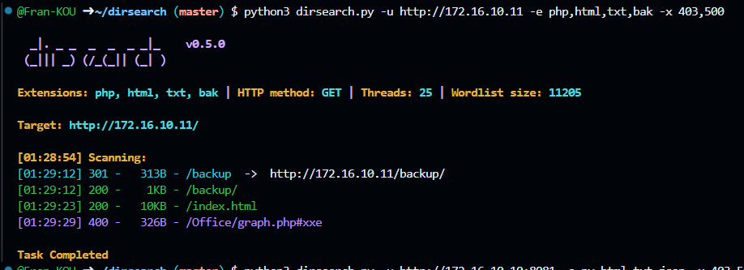
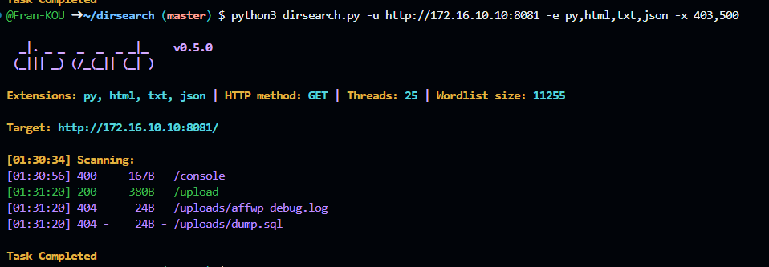
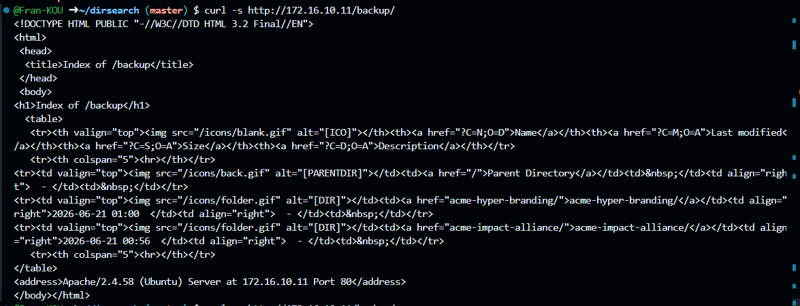
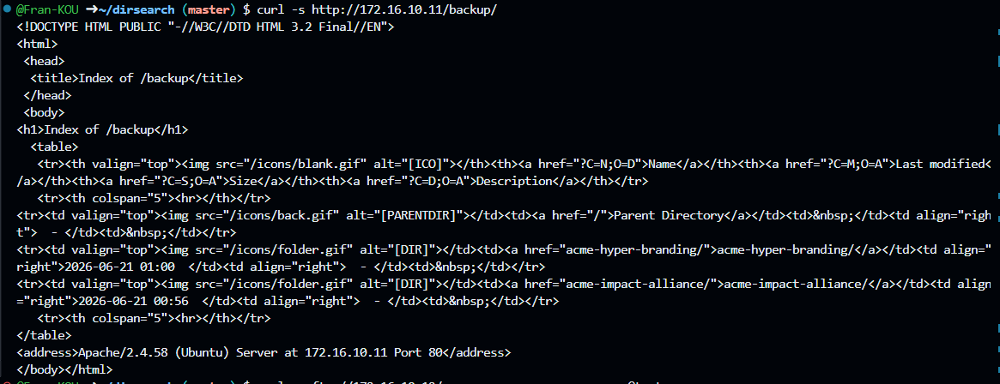
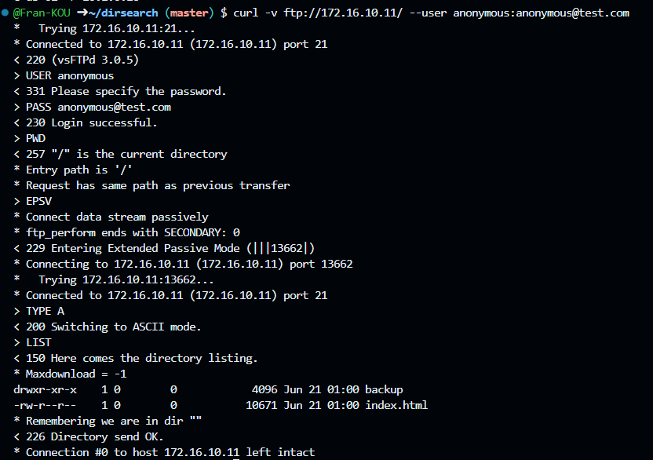

# PART 3.A — Laboratory Deployment & Architecture Documentation

# 1. Infrastructure Architecture Table

| Container Name | Full Network Hostname | Base Interface | Segment / Logical Subnet | Technical Role / Purpose |
| --- | --- | --- | --- | --- |
| **p-web-01** | 'p-web-01.acme-infinity-servers.com' | 'br_public' | Public ('172.16.10.0/24') | Main Web Server (Flask/Python - Port 80) |
| **p-web-02** | 'p-web-02' | 'br_public' | Public ('172.16.10.0/24') | Secondary Public Web Server |
| **p-ftp-01** | 'p-ftp-01' | 'br_public' | Public ('172.16.10.0/24') | Public FTP File Repository |
| **p-jumpbox-01**| 'p-jumpbox-01' | 'br_public' | Public ('172.16.10.0/24') | Network Bastion / Jump Host |
| **c-db-01** | 'c-db-01' | 'br_corporate' | Corporate ('10.1.0.0/24') | Primary Relational Database |
| **c-db-02** | 'c-db-02' | 'br_corporate' | Corporate ('10.1.0.0/24') | Secondary MySQL Database (Port 3306) |
| **c-redis-01** | 'c-redis-01' | 'br_corporate' | Corporate ('10.1.0.0/24') | In-Memory Key-Value Cache (Port 6379) |
| **c-backup-01** | 'c-backup-01' | 'br_corporate' | Corporate ('10.1.0.0/24') | Internal Data Backup Server |


# 2. Isolated Dual-Network Topology Diagrams

Based on the virtual interfaces ('veth') and network bridges validated on the Ubuntu host engine, the environment is strictly split into two independent Docker-managed segments:

# DIAGRAM A: Public Network Segment

  [ Ubuntu Host Interface: br_public ] ─── IP: 172.16.10.1 (Gateway)
                 │
                 ├── (veth) ─── [ p-web-01 ] ─── IP: 172.16.10.10
                 ├── (veth) ─── [ p-web-02 ] ─── IP: 172.16.10.20
                 ├── (veth) ─── [ p-ftp-01 ] ─── IP: 172.16.10.30
                 └── (veth) ─── [ p-jumpbox-01 ] ── IP: 172.16.10.40

# DIAGRAM B: Corporate Network Segment
[ Ubuntu Host Interface: br_corporate ] ─── IP: 10.1.0.1 (Gateway)
                 │
                 ├── (veth) ─── [ c-db-01 ] ──── IP: 10.1.0.30
                 ├── (veth) ─── [ c-db-02 ] ──── IP: 10.1.0.35
                 ├── (veth) ─── [ c-redis-01 ] ── IP: 10.1.0.40
                 └── (veth) ─── [ c-backup-01 ] ─ IP: 10.1.0.50

### 4. Interactive Container Access Verification (`docker exec`)

To validate local infrastructure access, communication hooks, and privilege boundaries, a live terminal session was initiated on the primary web instance (`p-web-01`).

# Executing interactive terminal routing to p-web-01
andres@andres-VirtualBox:~/Black-Hat-Bash/lab$ sudo docker exec -it p-web-01 bash

# Auditing user context assignment (Expected: root lifecycle)
root@p-web-01:/app# whoami
root

# Validating Internal FQDN resolution within the network bridge
root@p-web-01:/app# hostname
p-web-01.acme-infinity-servers.com

# Inspecting internal runtime directory mapping and application structures
root@p-web-01:/app# ls -la
total 40
drwxr-xr-x 1 root root 4096 Jun 20 17:54 .
drwxr-xr-x 1 root root 4096 Jun 20 17:54 ..
drwxr-xr-x 2 root root 4096 Jun 20 17:54 __pycache__
-rw-rw-r-- 1 root root 1832 Jun 20 17:33 app.py
drwxr-xr-x 1 root root 4096 Jun 20 17:52 files
-rw-rw-r-- 1 root root 7177 Jun 20 17:33 index.html
drwxr-xr-x 2 root root 4096 Jun 20 17:33 static
-rw-rw-r-- 1 root root  433 Jun 20 17:33 upload.html
drwxr-xr-x 2 root root 4096 Jun 20 17:52 uploads

# Severing session link and returning to Ubuntu host environment
root@p-web-01:/app# exit
exit


## Part 3.B — Ethical Hacking Techniques 

Two complementary techniques were executed against the public-network hosts, following a realistic reconnaissance flow: technology fingerprinting → path enumeration → weak/default credential verification.

### Technique 1 — Web Fingerprinting with WhatWeb

**What it does:** WhatWeb sends HTTP requests to a target and compares the response (headers, HTML, cookies, metadata) against a signature database to identify the server software, frameworks, backend languages, and CMS.

**Why it works:** Web servers routinely leak identifying information through standard headers (`Server`) and default HTML content. WhatWeb automates this passive reconnaissance without exploiting anything.

**Command and evidence — p-web-02 (172.16.10.12, via the address reassigned during the scan):**

```bash
ruby whatweb -v http://172.16.10.12
```

```
WhatWeb report for http://172.16.10.12
Status    : 200 OK
Title     : Apache2 Ubuntu Default Page: It works
Summary   : Apache[2.4.58], HTTPServer[Ubuntu Linux][Apache/2.4.58 (Ubuntu)]
```

**Interpretation:** The page title ("Apache2 Ubuntu Default Page") confirms that Apache was installed but the default landing page was never replaced with real content — an indicator of incomplete deployment. WhatWeb extracted the exact software version (Apache/2.4.58) directly from the `Server` header, information that in a real audit would be used to search for known CVEs associated with that specific version.

**Command and evidence — p-web-01 (172.16.10.10), after discovering via `ss -tlnp` that the actual service listens on port 8081, not port 80:**

```bash
ruby whatweb -v http://172.16.10.10:8081
```

```
WhatWeb report for http://172.16.10.10:8081
Status    : 200 OK
Title     : Menu
Summary   : HTML5, HTTPServer[Werkzeug/3.0.1 Python/3.12.3], Python[3.12.3], Werkzeug[3.0.1]
```

**Interpretation:** The `Server: Werkzeug/3.0.1 Python/3.12.3` header reveals that the service runs on Flask's built-in development server (Werkzeug), which **is not designed for production environments** and typically lacks security hardening. Detecting this component immediately points the next reconnaissance phase toward routes typical of Flask applications, such as the interactive debugger (`/console`).




---

### Technique 2 — Path Enumeration with dirsearch

**What it does:** dirsearch brute-forces HTTP paths using a wordlist of common file and directory names, reporting the response code for each attempt. This reveals content that isn't linked from the site's normal navigation.

**Why it works:** Many servers leave configuration files, admin panels, or backup directories accessible that don't appear in the visible menu but respond if the exact path is known (or guessed via dictionary).

**Command and evidence — p-web-02:**

```bash
python3 dirsearch.py -u http://172.16.10.12 -e php,html,txt,bak -x 403,500
```

```
301 -   313B - /backup  ->  http://172.16.10.12/backup/
200 -    1KB - /backup/
200 -   10KB - /index.html
```

Manual verification of the discovered content:

```bash
curl -s http://172.16.10.12/backup/
```

```
Index of /backup
[DIR] acme-hyper-branding/      2026-06-21 01:00
[DIR] acme-impact-alliance/     2026-06-21 00:56
```

**Interpretation:** Apache has **directory listing enabled** (`Options +Indexes`) for the `/backup/` path. This is a configuration weakness: anyone who enumerates or guesses that path can view and browse its full content without authentication. The discovered subdirectories (`acme-hyper-branding/`, `acme-impact-alliance/`) simulate client project backup folders — the type of sensitive information (source code, credentials, databases) that typically ends up exposed through this kind of flaw.

**Command and evidence — p-web-01:8081:**

```bash
python3 dirsearch.py -u http://172.16.10.10:8081 -e py,html,txt,json -x 403,500
```

```
400 -   167B - /console
200 -   380B - /upload
404 -    24B - /uploads/affwp-debug.log
404 -    24B - /uploads/dump.sql
```

**Interpretation:** The `/console` path corresponds to the **Werkzeug interactive debugger**, a development tool that, if active without PIN protection, allows arbitrary Python code execution from the browser. The `400` status code (rather than `404`) confirms that the path exists and is recognized by the application — behavior characteristic of Werkzeug when it rejects the request due to missing debugger credentials, instead of reporting "not found." This, together with the accessible `/upload` endpoint, suggests an attack surface designed for remote code execution exercises in later chapters of the book; for this submission level it is documented as a finding without further exploitation.






---

### Technique 3 — Anonymous FTP Check on p-ftp-01

**What it does:** An attempt is made to authenticate against the FTP service using the standard `anonymous` user, conventionally accepted by many misconfigured FTP servers without requiring a real password.

**Why it works:** The FTP protocol defines `anonymous` as a courtesy user, originally intended for public file repositories. If the administrator doesn't explicitly disable this option (`anonymous_enable=NO` in `vsftpd.conf`), the server grants read access without validating credentials.

**Command and evidence (172.16.10.11, executed from the attacker host, not from inside the container):**

```bash
curl -v ftp://172.16.10.11/ --user anonymous:anonymous@test.com
```

```
< 220 (vsFTPd 3.0.5)
> USER anonymous
< 331 Please specify the password.
> PASS anonymous@test.com
< 230 Login successful.
> PWD
< 257 "/" is the current directory
> LIST
drwxr-xr-x    1 0        0            4096 Jun 21 01:00 backup
-rw-r--r--    1 0        0           10671 Jun 21 01:00 index.html
< 226 Directory send OK.
```

**Interpretation:** The sequence `USER anonymous` → `PASS anonymous@test.com` → `230 Login successful` confirms that vsftpd 3.0.5 accepts anonymous login without validating any real password — any text sent after `PASS` is accepted. This constitutes a configuration flaw (not a software vulnerability). The granted access allows listing the root directory, where the same `backup/` folder observed via HTTP on `p-web-02` appears, demonstrating that the same sensitive content is accessible through **two different protocols** (HTTP and FTP) without real authentication — widening the exposure surface of the finding.



---

## Findings Summary

| # | Host | Finding | Relative Severity |
|---|---|---|---|
| 1 | p-web-02 | Unconfigured default Apache page | Informational |
| 2 | p-web-02 | `/backup/` with directory listing enabled, exposes client projects | Medium-High |
| 3 | p-web-01 | Werkzeug development server exposed, `/console` endpoint recognized | Medium-High |
| 4 | p-web-01 | `/upload` endpoint accessible with no apparent authentication | Medium |
| 5 | p-ftp-01 | Anonymous FTP enabled, exposes the same backup content via a second protocol | Medium-High |
| 6 | Architecture | `p-web-02` is dual-homed in addition to the jumpbox, a potential second pivot route | High (architectural) |

## Tools Used

- **WhatWeb** — installed from the official repository (https://github.com/urbanadventurer/WhatWeb), run with `ruby whatweb` due to an incomplete `apt` package installation in the Codespace environment.
- **dirsearch** — installed from https://github.com/maurosoria/dirsearch, run with `python3 dirsearch.py`.
- **curl** — used as a lightweight FTP/HTTP client, with no additional dependencies.

## Notes on the Execution Environment

The lab was deployed inside a GitHub Codespace (Ubuntu 24.04.4 LTS) instead of a traditional Kali VM. This does not affect the validity of the results: Docker, the `br_public`/`br_corporate` networks, and the lab's 8 containers behave identically regardless of the underlying host, as long as the Docker engine has privileges to create custom network bridges (confirmed via `ip addr | grep "br_"`).